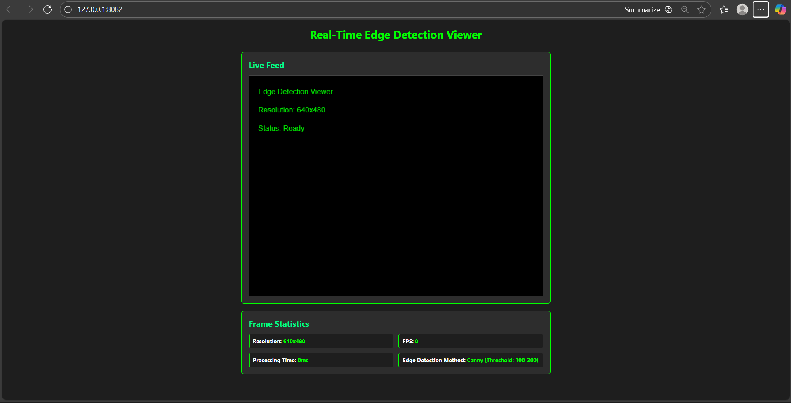

# Edge Detection Viewer (Android + OpenCV + Web)

A cross-platform Research & Development project:
- Real-time edge detection on Android using OpenCV (C++) and OpenGL ES 2.0.
- Visualizes processed frames in a modern TypeScript web UI.

---

## ✅ Features Implemented

### Android
- Real-time camera capture (Camera2 API)
- Native frame processing via **OpenCV** (C++/JNI)
- Canny edge detection (**customizable thresholds**)
- Zero-copy JNI image transfer (fast)
- OpenGL ES 2.0 overlay rendering
- Full NDK+CMake JNI build process

### Web
- Modern TypeScript Web Viewer (HTML5, CSS, TS)
- Displays stats (resolution, FPS, method)
- Responsive UI (dark mode green theme)
- Fast bundle via Webpack

---

## 📷 Screenshots

<!-- Insert these as  -->

**Android App:**


**Web App:**


---

## ⚙️ Setup Instructions

### Prerequisites

- Android Studio (Flamingo or newer)
- Android SDK 33+ and NDK 25+
- [OpenCV Android SDK 4.x](https://opencv.org/releases/)
- Node.js 18+ and npm

**Optional:**  
Set environment variable for adb in Windows PATH (for command line builds).

### Android (NDK, OpenCV setup)

1. Download and unzip OpenCV Android SDK.
2. Set this line in your `CMakeLists.txt` (adjust path as needed):

set(OpenCV_DIR "E:/opencv-android-sdk/opencv/sdk")

3. Open project in Android Studio.
4. **Sync Gradle**, then **Build > Rebuild Project**.
5. Run on emulator or device (camera needed for real-time).

### Web viewer

1. Go to `web/` directory:
 ```
 cd web
 npm install
 npm run build
 npx http-server dist
 ```
2. View output at [http://127.0.0.1:8080](http://127.0.0.1:8080)

---

## 🧠 Architecture Overview

### 1. Frame Flow

- **Android Camera2 API** →
- **ImageReader / TextureView** (Java) →
- **JNI bridge** passes YUV or RGBA buffers →
- **C++ (NDK) code** uses OpenCV for edge detection (applies Canny filter) →
- **Processed frame** sent back to Java →
- **GLSurfaceView / OpenGLRenderer** shows live edge-overlaid frame

### 2. JNI, NDK, and OpenCV
- All high-performance image processing occurs in native C++ using OpenCV, avoiding the Android Bitmap overhead.
- JNI functions expose frame buffer transfer and result delivery.
- CMake builds, links OpenCV statically for fast launch and small APK.

### 3. Web TypeScript Part
- Static web viewer is written in TypeScript and powered by HTML5 Canvas.
- Shows placeholder/demo frame, frame stats, and status.
- Code is modular and ready to extend for live image streaming.

---

## 🚦 Project Structure

EdgeDetectionViewer2/
├── app/ # Android app (Java/Kotlin, JNI)
│ ├── src/main/cpp/ # C++ OpenCV, JNI
│ ├── src/main/java/ # Java entrypoint, camera, GL
│ ├── src/main/res/ # layout and resources
│ └── CMakeLists.txt # NDK Build
├── web/ # TypeScript viewer
│ ├── src/ # index.ts, index.html, styles.css
│ └── dist/ # build output
├── screenshots/ # Add your final project screenshots here
└── README.md

---

## 💡 Quick Tips

- If `adb` not found, add `platform-tools` to PATH:  
  `setx PATH "%PATH%;E:\SDK\platform-tools"`
- Emulator camera may not work; prefer a real device for camera feed.
- If OpenCV isn't found at build time, double-check `CMakeLists.txt` path.

---

## 🙏 Credits & References

- Built using Android Studio, OpenCV, and TypeScript best practices.
- README template ideas from [Best-README-Template](https://github.com/othneildrew/Best-README-Template)[web:5].

---

